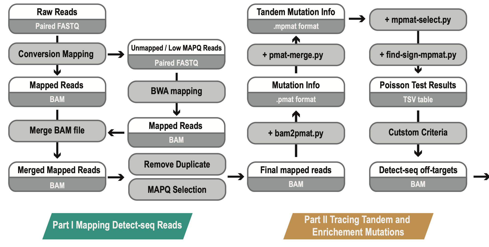
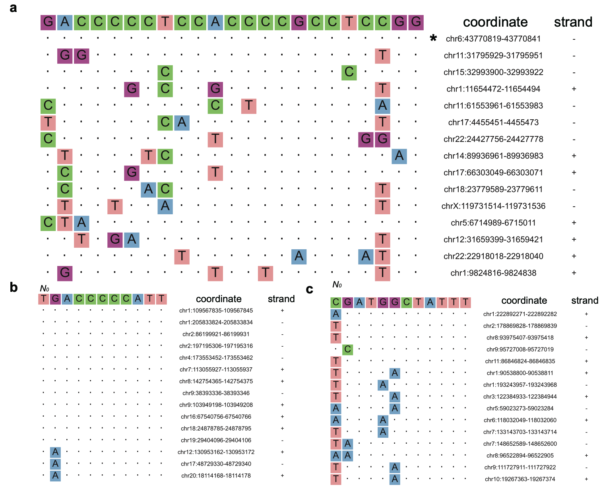

# Detect-seq

A chemical labeling and biotin pulldown approach for the unbiased, genome-wide off-target evaluation of programmable cytosine base editors

## Update log

1. 2021-07-01 first commit. By MENG Haowei
2. 2022-08-19 update version. Codes and algorithm design By MENG Haowei. Website, repository and document management By ZHAO Huanan.

## What is Detect-seq?

Detect-seq aims to find all reliable CBE/DdCBE induced off-target editings on the whole genome.

This set of experiments and analytical procedures were reported by the YiLab @ Peking University in 2021.

Find more at  [www.detect-seq.com](http://www.detect-seq.com)

## What is Detect-seq tool?


Detect-seq tool can help find off-target editings, sgRNA alignments, and performing visualization of results. One can carry on Detect-seq experiments and then analyze Detect-seq data with the Detect-seq tool.

## Citation

Please cite our publications if Detect-seq is used in your research.

```text
# CBE & Detect-seq
1. Lei, Z., Meng, H., Lv, Z., Liu, M., Zhao, H., Wu, H., ... & Yi, C. (2021). Detect-seq reveals out-of-protospacer editing and target-strand editing by cytosine base editors. Nature Methods, 18(6), 643-651.
# DdCBE & Detect-seq
2. Lei, Z., Meng, H., Liu, L., Zhao, H., Rao, X., Yan, Y., ... & Yi, C. (2022). Mitochondrial base editor induces substantial nuclear off-target mutations. Nature, 606(7915), 804-811.
```

## Environment

```shell
git clone https://github.com/menghaowei/Detect-seq.git
cd Detect-seq
# this conda env was tested on linux
conda env create -f conda-env.yaml
conda activate DetectSeq
```

configuration about [Hisat-3n](https://github.com/DaehwanKimLab/hisat2/tree/hisat-3n)

- - - - - -

# The best practice of Detect-seq analysis

In order to comprehensively present the Detect-seq analysis workflow, here we selected two representative Detect-seq datasets from samples of CRISPR-Cas based CBE (BE4max) and CRISPR-Cas free mitochondrial base editor (DdCBE) for bioinformatics analysis demonstration. The relative GEO accessions are GSE151265 and GSE173859. More specifically, one can download the Detect-seq data of BE4max with VEGFA_site2 sgRNA and a matched mCherry control sample under the accession GSM6416152 and GSM6416156; one can download the Detect-seq data of DdCBE-L1397N-ND6 and a matched GFP control sample under the accession GSM5281973 and GSM5281964. The GEO download instructions can be found at https://www.ncbi.nlm.nih.gov/geo/info/download.html And we rename the raw sequencing FASTQ file as follows.

```text
# BE4max VEGFA_site2 [GSM6416152]
Detect-293T-BE4max-VEGFA-All-PD_R1.fastq.gz
Detect-293T-BE4max-VEGFA-All-PD_R2.fastq.gz

# mCherry control [GSM6416156]
Detect-293T-BE4max-mCherry-PD_R1.fastq.gz
Detect-293T-BE4max-mCherry-PD_R2.fastq.gz

# DdCBE-L1397N-ND6 [GSM5281973]
Detect-293T-DdCBE-ND6-All-PD_R1.fastq.gz
Detect-293T-DdCBE-ND6-All-PD_R2.fastq.gz

# GFP control [GSM5281964]
Detect-293T-DdCBE-GFP-PD_R1.fastq.gz
Detect-293T-DdCBE-GFP-PD_R2.fastq.gz
```

## Analysis Protocol
- [0. Download reference genome](#0-download-reference-genome)
- [1. Map the Detect-seq reads](#1-map-the-detect-seq-reads)
- [2. Low mapping quality reads re-alignment](#2-low-mapping-quality-reads-re-alignment)
- [3. Duplication removal and reads cleaning of BAM files](#3-duplication-removal-and-reads-cleaning-of-bam-files)
- [4. Tracing tandem C-to-T signals and perform statistical test](#4-tracing-tandem-c-to-t-signals-and-perform-statistical-test)
- [5. Criteria selection and downstream analysis](#5-criteria-selection-and-downstream-analysis)



**All Scripts and Codes can be found at `/src/detect_seq`**

**All Output Examples can be found at `/data/example_results`**

**We also offer a SnakeMake workflow at `/snakemake/`**

## 0. Download reference genome

```shell
# Download reference genome
for index in {1..22} X Y M;
do
	wget -c https://hgdownload.soe.ucsc.edu/goldenPath/hg38/chromosomes/chr${index}.fa.gz
done

# merge reference FASTA
fa_file=""
for index in {1..22} X Y M;
do
	fa_file=${fa_file}" "chr${index}.fa.gz
done
cat $fa_file > hg38_only_chromosome.fa.gz

# decompression
gzip -d  hg38_only_chromosome.fa.gz &

# build FASTA index
samtools faidx hg38_only_chromosome.fa

# build BWA MEM index
mkdir bwa_hg38
cd bwa_hg38
cp ../hg38_only_chromosome.fa* ./ 
bwa index hg38_only_chromosome.fa hg38_only_chromosome.fa > bwa_build.log 2>&1 &

# build HISAT3N index
mkdir hisat3n_hg38_CT
cp ./hg38_only_chromosome.fa* ./hisat3n_hg38_CT
hisat-3n-build --base-change C,T hg38_only_chromosome.fa hg38_only_chromosome.fa > hisat3n_hg38_CT_index.log 2>&1 &
```


## 1. Map the Detect-seq reads

Map the Detect-seq sequencing reads to the reference genome by HISAT-3N, which uses a base conversion alignment strategy.

```shell
# remove sequencing adapter 
mkdir fix.fastq

for sample in 293T-BE4max-mCherry-PD 293T-BE4max-VEGFA-All-PD 293T-DdCBE-GFP-PD 293T-DdCBE-ND6-All-PD
do
    in_fq_R1=raw.fastq/Detect-${sample}_R1.fastq.gz
in_fq_R2=raw.fastq/Detect-${sample}_R2.fastq.gz

    out_fq_R1=fix.fastq/Detect-${sample}_R1_cutadapt.fq.gz
out_fq_R2=fix.fastq/Detect-${sample}_R2_cutadapt.fq.gz

    log=fix.fastq/Detect-${sample}_cutadapt.log

    cutadapt -j 20 --times 1  -e 0.1  -O 3  --quality-cutoff 25 -m 55 -a AGATCGGAAGAGCACACGT  -A  AGATCGGAAGAGCGTCGTG -o ${out_fq_R1} -p ${out_fq_R2} ${in_fq_R1} ${in_fq_R2} > ${log} 2>&1 &
done

# HISAT-3N mapping
mkdir bam.hisat3n

for sample in 293T-BE4max-mCherry-PD 293T-BE4max-VEGFA-All-PD 293T-DdCBE-GFP-PD 293T-DdCBE-ND6-All-PD
do
    in_fq_R1=fix.fastq/Detect-${sample}_R1_cutadapt.fq.gz
    in_fq_R2=fix.fastq/Detect-${sample}_R2_cutadapt.fq.gz
    out_bam=bam.hisat3n/${sample}_hisat3n_hg38.bam 

    ummapped_fq=bam.hisat3n/${sample}_hisat3n_hg38_unmapped.fq.gz
    log=bam.hisat3n/${sample}_hisat3n.log
    ref_idx=reference/hisat3n_hg38_CT/hg38_only_chromosome.fa

    hisat-3n -x ${ref_idx} -1 ${in_fq_R1} -2 ${in_fq_R2} -p 20 --sensitive --base-change C,T --unique-only --repeat-limit 1000 --no-spliced-alignment -X 700 --un-conc-gz ${ummapped_fq} --summary-file ${log} --rg-id ${sample} --rg "PL:ILLUMINA" --rg "ID:"${sample} --rg "SM:"${sample} | samtools view -hb > ${out_bam} &
done
```

## 2. Low mapping quality reads re-alignment
Merge the low mapping quality reads or unmapped reads and subject them to a re-alignment step. In this step, we utilize a non-conversion aligner like BWA MEM to re-align those reads to the reference genome.

```shell
# select low mapping quality BAM
for sample in 293T-BE4max-mCherry-PD 293T-BE4max-VEGFA-All-PD 293T-DdCBE-GFP-PD 293T-DdCBE-ND6-All-PD
do  
    in_bam=bam.hisat3n/${sample}_hisat3n_hg38.bam 
    out_bam=bam.hisat3n/${sample}_hisat3n_hg38.MAPQ20.LowerMAPQ20.bam

    samtools view -h -@ 4 ${in_bam} | awk '$1~"@" || $5 <= 20  {print $0}' |  samtools view -@ 4 -hb > ${out_bam} &
done

# BAM sort by reads name
for sample in 293T-BE4max-mCherry-PD 293T-BE4max-VEGFA-All-PD 293T-DdCBE-GFP-PD 293T-DdCBE-ND6-All-PD
do  
    in_bam=bam.hisat3n/${sample}_hisat3n_hg38.MAPQ20.LowerMAPQ20.bam
    out_bam=bam.hisat3n/${sample}_hisat3n_hg38.MAPQ20.LowerMAPQ20.SortName.bam
    temp_file=bam.hisat3n/${sample}_hisat3n_hg38.MAPQ20.LowerMAPQ20.SortName.bam.temp

    samtools sort -O BAM -o ${out_bam} -T ${temp_file} -@ 15 -m 2G -n ${in_bam} &
done

# fetch low mapping quality reads from BAM file
for sample in 293T-BE4max-mCherry-PD 293T-BE4max-VEGFA-All-PD 293T-DdCBE-GFP-PD 293T-DdCBE-ND6-All-PD
do  
in_bam=bam.hisat3n/${sample}_hisat3n_hg38.MAPQ20.LowerMAPQ20.SortName.bam
    ref_genome_fa=reference/hisat3n_hg38_CT/hg38_only_chromosome.fa
    out_fq_R1=bam.hisat3n/${sample}_hisat3n_hg38.LowerMAPQ20_R1.fq.gz
out_fq_R2=bam.hisat3n/${sample}_hisat3n_hg38.LowerMAPQ20_R2.fq.gz

    samtools fastq -@ 15 -0 /dev/null -s /dev/null -n -F 0x900 -1 ${out_fq_R1} -2 ${out_fq_R2} --reference ${ref_genome_fa}  ${in_bam} &
done

# merge unmapped reads and low mapping quality reads
for sample in 293T-BE4max-mCherry-PD 293T-BE4max-VEGFA-All-PD 293T-DdCBE-GFP-PD 293T-DdCBE-ND6-All-PD
do  
    low_fq_R1=bam.hisat3n/${sample}_hisat3n_hg38.LowerMAPQ20_R1.fq.gz
    low_fq_R2=bam.hisat3n/${sample}_hisat3n_hg38.LowerMAPQ20_R2.fq.gz

    unmapped_fq_R1=bam.hisat3n/${sample}_hisat3n_hg38_unmapped.fq.1.gz
    unmapped_fq_R2=bam.hisat3n/${sample}_hisat3n_hg38_unmapped.fq.2.gz

    out_fq_R1=bam.hisat3n/${sample}_R1_unmapped_and_LowerMAPQ20.fq.gz
    out_fq_R2=bam.hisat3n/${sample}_R2_unmapped_and_LowerMAPQ20.fq.gz

    cat ${low_fq_R1} ${unmapped_fq_R1} > ${out_fq_R1} &
    cat ${low_fq_R2} ${unmapped_fq_R2} > ${out_fq_R2} & 
done

# re-alignment with BWA MEM
for sample in 293T-BE4max-mCherry-PD 293T-BE4max-VEGFA-All-PD 293T-DdCBE-GFP-PD 293T-DdCBE-ND6-All-PD
do  
    in_fq_R1=bam.hisat3n/${sample}_R1_unmapped_and_LowerMAPQ20.fq.gz
    in_fq_R2=bam.hisat3n/${sample}_R2_unmapped_and_LowerMAPQ20.fq.gz
    bwa_index=reference/bwa_hg38/hg38_only_chromosome.fa

    out_bam=bam.hisat3n/${sample}_bwa_hg38_realign.bam
    bwa_log=bam.hisat3n/${sample}_bwa_hg38_realign.log

    bwa mem ${bwa_index}${in_fq_R1} {in_fq_R2} -t 20 -M -R '@RG\tID:'${sample}'\tPL:ILLUMINA\tSM:'${sample} 2>${bwa_log} | samtools view -h -b -q 20 -f 3 -F 256 > ${out_bam} &
done
```

## 3. Duplication removal and reads cleaning of BAM files
Merge the HISAT-3N alignment BAM file and the BWA MEM alignment BAM file together, and then remove the duplication reads, non-concordant reads, clipped mapping reads and the secondary alignment reads. Only reads with a mapping quality larger than 20 are retained for subsequent analysis.

```shell
# merge HISAT-3n BAM and BWA MEM BAM
for sample in 293T-BE4max-mCherry-PD 293T-BE4max-VEGFA-All-PD 293T-DdCBE-GFP-PD 293T-DdCBE-ND6-All-PD
do  
    in_bam_bwa=bam.hisat3n/${sample}_bwa_hg38_realign.bam
    in_bam_hisat3n=bam.hisat3n/${sample}_hisat3n_hg38.bam 
    out_bam=bam.hisat3n/${sample}_hg38_merge.MAPQ20.bam

    samtools cat -o ${out_bam} ${in_bam_hisat3n} ${in_bam_bwa} &
done

# sort BAM by genome coordinate
for sample in 293T-BE4max-mCherry-PD 293T-BE4max-VEGFA-All-PD 293T-DdCBE-GFP-PD 293T-DdCBE-ND6-All-PD
do  
    in_bam=bam.hisat3n/${sample}_hg38_merge.MAPQ20.bam
    out_bam=bam.hisat3n/${sample}_hg38_merge_sort.MAPQ20.bam
    temp_file=bam.hisat3n/${sample}_hg38_merge_sort.MAPQ20.bam.temp

    samtools sort -O BAM -o ${out_bam} -T ${temp_file} -@ 15 -m 2G ${in_bam} &
done

# remove duplication
for sample in 293T-BE4max-mCherry-PD 293T-BE4max-VEGFA-All-PD 293T-DdCBE-GFP-PD 293T-DdCBE-ND6-All-PD
do  
    in_bam=bam.hisat3n/${sample}_hg38_merge_sort.MAPQ20.bam

    out_log=bam.hisat3n/${sample}_hg38_merge_sort_rmdup.log
    out_bam=bam.hisat3n/${sample}_hg38_merge_sort_rmdup.MAPQ20.WithClip.bam
    out_matrix=bam.hisat3n/${sample}_hg38_merge_sort_rmdup.matrix
    
    java -Xms50g -Xmx50g -XX:ParallelGCThreads=20 -jar picard.jar MarkDuplicates I=${in_bam} O=${out_bam} M=${out_matrix} ASO=coordinate REMOVE_DUPLICATES=true 2> ${out_log} &
done

# filter clip, non-concordant reads, low MAPQ reads and secondary alignment
for sample in 293T-BE4max-mCherry-PD 293T-BE4max-VEGFA-All-PD 293T-DdCBE-GFP-PD 293T-DdCBE-ND6-All-PD
do  
    in_bam=bam.hisat3n/${sample}_hg38_merge_sort_rmdup.MAPQ20.WithClip.bam
    out_bam=bam.hisat3n/${sample}_hg38_merge_sort_rmdup.MAPQ20.bam
    ref_genome_fa=reference/hisat3n_hg38_CT/hg38_only_chromosome.fa
    
    samtools view -@ 4 -h ${in_bam} -q 20 -f 3 -F 256 | samclip --ref ${ref_genome_fa} --max 3 --progress 0 | awk 'function abs(v) {return v < 0 ? -v : v} $1~"@" || ($7 == "=" && abs($9) <= 2500 ) {print $0}' | samtools view -@ 4 -hb > ${out_bam} &
done

# build BAM index
for sample in 293T-BE4max-mCherry-PD 293T-BE4max-VEGFA-All-PD 293T-DdCBE-GFP-PD 293T-DdCBE-ND6-All-PD
do  
    in_bam=bam.hisat3n/${sample}_hg38_merge_sort_rmdup.MAPQ20.bam
    out_bam_index=bam.hisat3n/${sample}_hg38_merge_sort_rmdup.MAPQ20.bam.bai
    
    samtools index -@ 10 ${in_bam} ${out_bam_index} &
done
```

## 4. Tracing tandem C-to-T signals and perform statistical test

Catch contiguous tandem mutation information from BAM files (i.e., tandem C-to-T mutation signals for the Watson strand and tandem G-to-A mutation signals for the Crick strand). Then perform a comparison for those tandem mutation signals between control sample and Detect-seq treatment sample by the Poisson statistical test. After this step, one can obtain tables containing information of tandem mutation signals (a mpmat file shown in the code part) and matched Poisson test results (a TSV table shown in the code part).

```shell
# convert BAM to pmat format
mkdir pmat_and_mpmat

for sample in 293T-BE4max-VEGFA-All-PD  293T-DdCBE-ND6-All-PD
do  
    in_bam=bam.hisat3n/${sample}_hg38_merge_sort_rmdup.MAPQ20.bam
    ref_genome_fa=reference/hisat3n_hg38_CT/hg38_only_chromosome.fa
    out_pmat=pmat_and_mpmat/${sample}_hg38_merge_sort_rmdup.MAPQ20.pmat
    out_log=pmat_and_mpmat/${sample}_hg38_merge_sort_rmdup.MAPQ20.bam2pmat.log

python bam2pmat.py -i ${in_bam} -r ${ref_genome_fa} -o ${out_pmat} -p 20 --out_format pmat --bed_like_format True --mut_type ALL --block_size 100000  --cover_num_cutoff 0 --mut_num_cutoff 0 --mut_ratio_cutoff 0 --keep_temp_file False --out_header False > ${out_log}  2>&1 &

done


# select 

# tracing tandem mutation signals
for sample in 293T-BE4max-VEGFA-All-PD  293T-DdCBE-ND6-All-PD
do  
    ref_genome_fa=reference/hisat3n_hg38_CT/hg38_only_chromosome.fa
    in_pmat=pmat_and_mpmat/${sample}_hg38_merge_sort_rmdup.MAPQ20.pmat
		out_C_pmat=pmat_and_mpmat/${sample}_hg38_merge_sort_rmdup.MAPQ20_C.pmat
    out_G_pmat=pmat_and_mpmat/${sample}_hg38_merge_sort_rmdup.MAPQ20_G.pmat


    out_CT_mpmat=pmat_and_mpmat/${sample}_hg38.MAPQ20.merge_d50_D100.CT.mpmat
    out_GA_mpmat=pmat_and_mpmat/${sample}_hg38.MAPQ20.merge_d50_D100.GA.mpmat
    out_CT_log=pmat_and_mpmat/${sample}_hg38.MAPQ20.merge_d50_D100.CT.mpmat.log
    out_GA_log=pmat_and_mpmat/${sample}_hg38.MAPQ20.merge_d50_D100.GA.mpmat.log

    # CT on the Watson strand
    awk '$10 == "C" {print $0}' ${in_pmat} > ${out_C_pmat} &
    
    python pmat-merge.py -i ${out_C_pmat} -f C -t T -r ${ref_genome_fa} -d 50 -D 100 --NoMutNumCutoff 2 --OmitTandemNumCutoff 2 -o ${out_CT_mpmat} --SNP snv_info/293T-snv_info.list1.bed,snv_info/293T-snv_info.list2.vcf 2> ${out_CT_log} &
    
    # CT on the Crick strand
    awk '$10 == "G" {print $0}' ${in_pmat} > ${out_G_pmat} &
    
    python pmat-merge.py -i ${out_G_pmat} -f G -t A -r ${ref_genome_fa} -d 50 -D 100 --NoMutNumCutoff 2 --OmitTandemNumCutoff 2 -o ${out_GA_mpmat} --SNP snv_info/293T-snv_info.list1.bed,snv_info/293T-snv_info.list2.vcf 2> ${out_GA_log} &
done

# merge tandem mutation signals and sort
for sample in 293T-BE4max-VEGFA-All-PD  293T-DdCBE-ND6-All-PD
do  
    in_CT_mpmat=pmat_and_mpmat/${sample}_hg38.MAPQ20.merge_d50_D100.CT.mpmat
    in_GA_mpmat=pmat_and_mpmat/${sample}_hg38.MAPQ20.merge_d50_D100.GA.mpmat
    ref_genome_fa_index=reference/hisat3n_hg38_CT/hg38_only_chromosome.fa.fai

    out_CT_mpmat=pmat_and_mpmat/${sample}_hg38.MAPQ20.merge_d50_D100.CT.select.mpmat
    out_GA_mpmat=pmat_and_mpmat/${sample}_hg38.MAPQ20.merge_d50_D100.GA.select.mpmat    
    out_merge_mpmat=pmat_and_mpmat/${sample}_hg38.MAPQ20.merge_d50_D100.merge.select.mpmat
out_merge_sort_mpmat=pmat_and_mpmat/${sample}_hg38.MAPQ20.merge.select.sort.mpmat
out_rm_chr_mpmat=pmat_and_mpmat/${sample}_hg38.MAPQ20.merge.select.sort.RmChrYChrM.mpmat

    # select CT
    python mpmat-select.py -i {in_CT_mpmat} -o ${out_CT_mpmat} -f C -t T -m 4 -c 6 -r 0.01 --RegionPassNum 1 --RegionToleranceNum 10 --RegionMutNum 2 --InHeader True --OutHeader False

    # select GA
    python mpmat-select.py -i {in_GA_mpmat} -o ${out_GA_mpmat} -f G -t A -m 4 -c 6 -r 0.01 --RegionPassNum 1 --RegionToleranceNum 10 --RegionMutNum 2 --InHeader True --OutHeader False
 # merge CT singal on the Watson strand and the Crick strand
    cat ${out_CT_mpmat} ${out_GA_mpmat}  > ${out_merge_mpmat}

    # sort by the genome coordinate
    bedtools sort -i ${out_merge_mpmat} -g ${ref_genome_fa_index} | uniq > ${out_merge_sort_mpmat}

    # remove chrY and chrM
    cat ${out_merge_sort_mpmat} | grep -v chrY | grep -v chrM > ${out_rm_chr_mpmat}
done

# run the Poisson enrichment test
ref_genome_fa=reference/hisat3n_hg38_CT/hg38_only_chromosome.fa

# for BE4max sample
python find-significant-mpmat.py -p 25 \
-i pmat_and_mpmat/293T-BE4max-VEGFA-All-PD_hg38.MAPQ20.merge.select.sort.RmChrYChrM.mpmat \
-o poisson_res/293T-BE4max-VEGFA-All-PD_vs_ctrl_hg38.select.pvalue_table \
-c bam.hisat3n/293T-BE4max-mCherry-PD_hg38_merge_sort_rmdup.MAPQ20.bam \
-t bam.hisat3n/293T-BE4max-VEGFA-All-PD_hg38_merge_sort_rmdup.MAPQ20.bam \
-r ${ref_genome_fa} \
--query_mutation_type CT,GA  \
--mpmat_filter_info_col_index -1 \
--mpmat_block_info_col_index -1  \
--region_block_mut_num_cutoff 2  \
--query_mut_min_cutoff 2  \
--query_mut_max_cutoff 16  \
--total_mut_max_cutoff 16  \
--other_mut_max_cutoff 6   \
--seq_reads_length 150  \
--lambda_method ctrl_max \
--poisson_method mutation \
2> poisson_res/293T-BE4max-VEGFA-All-PD_vs_ctrl_hg38_possion_test.log &

# for DdCBE sample
python find-significant-mpmat.py -p 25 \
-i pmat_and_mpmat/293T-DdCBE-ND6-All-PD_hg38.MAPQ20.merge.select.sort.RmChrYChrM.mpmat \
-o poisson_res/293T-DdCBE-ND6-All-PD_vs_ctrl_hg38.select.pvalue_table \
-c bam.hisat3n/293T-DdCBE-GFP-PD_hg38_merge_sort_rmdup.MAPQ20.bam \
-t bam.hisat3n/293T-DdCBE-ND6-All-PD_hg38_merge_sort_rmdup.MAPQ20.bam \
-r ${ref_genome_fa} \
--query_mutation_type CT,GA  \
--mpmat_filter_info_col_index -1 \
--mpmat_block_info_col_index -1  \
--region_block_mut_num_cutoff 2  \
--query_mut_min_cutoff 2  \
--query_mut_max_cutoff 16  \
--total_mut_max_cutoff 16  \
--other_mut_max_cutoff 6   \
--seq_reads_length 150  \
--lambda_method ctrl_max \
--poisson_method mutation \
2> poisson_res/293T-DdCBE-ND6-All-PD_vs_ctrl_hg38_possion_test.log &
```

### doc for the output `pvalue_table`

An output example for the enrichment significance test results.

#### header explaination 

- `chr_name`: str, chromosome name of tested region, value like 'chr1', 'chr2' ...
- `region_start`: int, the start coordinate of the tested region, and the coordinate index is based on a 1-based scale.
- `region_end`: int, the end coordinate of the tested region, and the coordinate index is based on a 1-based scale.
- `mpmat_index`: str, a formatted string, which can be used as a key to index the whole table.
- `region_site_num`: int, number of sites (C or G) in the tested region
- `region_block_site_num`: int, number of sites that present a mutation signal in the control sample (C-to-T or G-to-A). The blocked sites are omitted in the enrichment test step.
- `region_mut_site_num`: int, number of sites with mutated signals in the treatment sample. Note, the blocked sites are not considered.
- `region_site_index`: str list, split by comma, list length is the same as <region_site_num>, and each item in this list is the site coordinate of the genome.
- `region_block_state`: str list, split by -, list length is the same as <region_site_num>, “B” means site is blocked, and "N" means site is not blocked.
- `region_highest_site_index`: str, coordinate of site with the highest Detect-seq signal.
- `region_highest_site_mut_num`: int, count of sequencing reads with tandem mutation info for the site with the highest Detect-seq signal.
- `region_highest_site_cover_num`: int, total count of sequencing reads for the site with the highest Detect-seq signal.
- `region_highest_site_mut_ratio`: float, range 0~1, mutation ratio, which equals <region_highest_site_mut_num> / <region_highest_site_cover_num>
- `ctrl_count`: int, total count of sequencing reads in the control sample; if a read overlaps with the tested region, it will be counted.
- `treat_count`: int, total count of sequencing reads in treat sample.
- `ctrl_mut_count`: int, count of sequencing reads with C-to-T / G-to-A mutation info in control sample.
- `treat_mut_count`: int, count of sequencing reads with C-to-T / G-to-A mutation info in treat sample.
- `ctrl_count.nor`:, float, normalized <ctrl_count>, the default value equals count per million.
- `treat_count.nor`:, float, normalized <treat_count>, the default value equals count per million.
- `ctrl_mut_count.nor`:, float, normalized <ctrl_mut_count>, the default value equals count per million.
- `treat_mut_count.nor`:, float, normalized <treat_mut_count>, the default value equals count per million.
- `count_info`: meaning less in this version.
- `log2_FC`: float, log2 fold-change, which equals log2(<treat_count.norm> / <ctrl_count.norm>)
- `log2_FC_mut`: float, log2 fold-change, which equals log2(<treat_mut_count.norm> / <ctrl_mut_count.norm>)
- `test_state`: str, "TestOK" means the Poisson enrichment test works well.
- `p_value`: float, the p-value from the Poisson enrichment test.
- `FDR`: float, adjusted p-value with BH methods.			

```text
																
chr_name	region_start	region_end	mpmat_index	region_site_num	region_block_site_num	region_mut_site_num	region_site_index	region_block_state	region_highest_site_index	region_highest_site_mut_num	region_highest_site_cover_num	region_highest_site_mut_ratio	ctrl_count	treat_count	ctrl_mut_count	treat_mut_count	ctrl_count.norm	treat_count.norm	ctrl_mut_count.norm	treat_mut_count.norm	count_info	log2_FC	log2_FC_mut	test_state	p_value	FDR
chr1	49272	49288	chr1_49272_49288	3	1	2	"chr1_49272_GA,chr1_49276_G.,chr1_49288_GA"	B-N-N	chr1_49288_GA	1	5	0.2	11	10	0	0	0.080257214	0.051644633	0	0	"0,1,2,3 10,1,0,0 9,1,0,0"	-0.63601266	NA	TestOK	0.5	0.511034942
chr1	49515	49529	chr1_49515_49529	3	0	3	"chr1_49515_GA,chr1_49521_G.,chr1_49529_GA"	N-N-N	chr1_49515_GA	1	3	0.333333333	9	12	1	1	0.065664993	0.061973559	0.00729611	0.005164463	"0,1,2,3 0,8,1,0 3,8,1,0"	-0.083471637	-0.498509136	TestOK	0.5	0.511034942
chr1	73840	73842	chr1_73840_73842	3	1	2	"chr1_73840_CT,chr1_73841_CT,chr1_73842_CT"	N-B-N	chr1_73840_CT	1	16	0.0625	16	22	0	0	0.116737766	0.113618192	0	0	"0,1,2,3 13,3,0,0 20,2,0,0"	-0.039077518	NA	TestOK	0.5	0.511034942
chr1	99045	99092	chr1_99045_99092	10	0	10	"chr1_99045_CT,chr1_99046_CT,chr1_99055_CT,chr1_99059_CT,chr1_99061_CT,chr1_99069_CT,chr1_99072_CT,chr1_99083_CT,chr1_99088_CT,chr1_99092_CT"	N-N-N-N-N-N-N-N-N-N	chr1_99045_CT	1	6	0.166666667	18	14	9	7	0.131329987	0.072302486	0.065664993	0.036151243	"0,1,2,3,4,5,6,7,8,9,10 7,1,2,1,0,2,1,0,1,0,3 7,0,2,0,0,0,1,2,0,0,2"	-0.861079216	-0.861079216	TestOK	0.687775284	0.699676496
chr1	144871	144900	chr1_144871_144900	4	0	4	"chr1_144871_GA,chr1_144873_GA,chr1_144875_GA,chr1_144900_GA"	N-N-N-N	chr1_144871_GA	2	10	0.2	7	15	1	3	0.051072773	0.077466949	0.00729611	0.01549339	"0,1,2,3,4 1,5,0,1,0 5,7,0,3,0"	0.601026537	1.086453364	TestOK	0.173669361	0.32172689
chr1	184167	184193	chr1_184167_184193	9	0	9	"chr1_184167_GA,chr1_184168_GA,chr1_184170_GA,chr1_184176_GA,chr1_184177_GA,chr1_184178_GA,chr1_184185_GA,chr1_184188_GA,chr1_184193_GA"	N-N-N-N-N-N-N-N-N	chr1_184167_GA	4	24	0.166666667	19	33	0	4	0.138626097	0.170427288	0	0.020657853	"0,1,2,3,4,5,6,7,8,9 15,4,0,0,0,0,0,0,0,0 27,2,2,0,0,1,0,0,0,1"	0.29795747	1.130606173	TestOK	0.01821861	0.094641139
chr1	191997	192025	chr1_191997_192025	3	1	2	"chr1_191997_GA,chr1_192015_G.,chr1_192025_GA"	N-N-B	chr1_191997_GA	1	14	0.071428571	7	16	0	0	0.051072773	0.082631412	0	0	"0,1,2,3 7,0,0,0 14,2,0,0"	0.694135942	NA	TestOK	0.5	0.511034942
chr1	271391	271413	chr1_271391_271413	5	2	3	"chr1_271391_CT,chr1_271396_CT,chr1_271401_CT,chr1_271406_CT,chr1_271413_CT"	N-N-S-S-N	chr1_271391_CT	1	7	0.142857143	5	13	0	2	0.036480552	0.067138022	0	0.010328927	"0,1,2,3,4,5 4,1,0,0,0,0 5,6,1,1,0,0"	0.880002487	0.130606173	TestOK	0.094520046	0.209966519
...
```


## 5. Criteria selection and downstream analysis

### 5.1 Criteria for selection of significant Detect-seq signals

Select the significant Detect-seq signals according to the Poisson test results with a certain criterion. Note that an arbitrary criterion could introduce potential false positive or false negative issues. In fact, Detect-seq of BE4max and DdCBE samples show different mutation patterns, which require corresponding thresholds. Here, we recommend two criteria, one strict and another lenient, for users to select the significant Detect-seq signals of BE4max or DdCBE samples. The following codes can run in an R session.

```R
# 1. BE4max 
rm(list=ls())

library(tidyverse)

setwd(dir = "./detect_nat_protocol/")

#-------------------------------------------------------------------------->>>>>>>
# 1.1 find sign region
#-------------------------------------------------------------------------->>>>>>>

# load merge table
poisson_res = read_tsv(file = "./poisson_res/293T-BE4max-VEGFA-All-PD_vs_ctrl_hg38.select.pvalue_table")

# check column name
colnames(poisson_res)

#-------------------------------------------------------------------------->>>>>>>
# select significant Detect-seq signals
#-------------------------------------------------------------------------->>>>>>>
# strict selection 
poisson_res.sign.strict = filter(
  poisson_res, 
  FDR < 0.0001 ,
  log2_FC_mut >= 2, 
  ctrl_mut_count <= 1,
  treat_mut_count.norm * 100 >= 10,
  treat_mut_count >= 20,
  treat_mut_count / treat_count >= 0.15,
  region_block_site_num <= 1,
  region_highest_site_mut_ratio >= 0.35
)

# lenient selection 
poisson_res.sign.lenient = filter(
  poisson_res, 
  FDR < 0.01 ,
  log2_FC_mut >= 2, 
  ctrl_mut_count <= 1,
  treat_mut_count.norm * 100 >= 5,
  treat_mut_count >= 10,
  treat_mut_count / treat_count >= 0.15,
  region_block_site_num <= 1,
  region_highest_site_mut_ratio >= 0.30
)

# --------------------------------------------------------------------------------->>>>>
# get corresponding mpmat file
# --------------------------------------------------------------------------------->>>>>
# mpmat table column type
col_type_info = cols(
  X1 = col_character(),
  X2 = col_double(),
  X3 = col_double(),
  X4 = col_double(),
  X5 = col_double(),
  X6 = col_double(),
  X7 = col_character(),
  X8 = col_character(),
  X9 = col_character(),
  X10 = col_character(),
  X11 = col_character(),
  X12 = col_character(),
  X13 = col_character()
)

mpmat_filename = "./pmat_and_mpmat/293T-BE4max-VEGFA-All-PD_hg38.MAPQ20.merge.select.sort.RmChrYChrM.mpmat"
mpmat_table = read_tsv(file = mpmat_filename, col_names = F, col_types = col_type_info)
colnames(mpmat_table)[1:3] = c("chrom", "start", "end")
mpmat_table.AddIdx <- mpmat_table %>% unite("mpmat_index", chrom:end, sep = "_", remove = F)

# strict mpmat select 
mpmat_table.strict.select <- filter(
  mpmat_table.AddIdx,
  mpmat_index %in% poisson_res.sign.strict$mpmat_index
) %>% select(
  -mpmat_index
)

write_tsv(mpmat_table.strict.select, file = "./final_list/293T-BE4max-VEGFA.StrictList.mpmat", col_names = F)

# lenient mpmat select 
mpmat_table.lenient.select <- filter(
  mpmat_table.AddIdx,
  mpmat_index %in% poisson_res.sign.lenient$mpmat_index
) %>% select(
  -mpmat_index
)

write_tsv(mpmat_table.lenient.select, file = "./final_list/293T-BE4max-VEGFA.LenientList.mpmat", col_names = F)

# 2. DdCBE
rm(list=ls())
library(tidyverse)
setwd(dir = "./detect_nat_protocol/")

#-------------------------------------------------------------------------->>>>>>>
# 2.1 find sign region
#-------------------------------------------------------------------------->>>>>>>

# load merge table
poisson_res = read_tsv(file = "./poisson_res/293T-DdCBE-ND6-All-PD_vs_ctrl_hg38.select.pvalue_table")

# check column name
colnames(poisson_res)

# strict selection 
poisson_res.sign.strict = filter(
  poisson_res, 
  FDR < 0.0001 ,
  log2_FC_mut >= 2, 
  ctrl_mut_count <= 1,
  treat_mut_count.norm * 100 >= 10,
  treat_mut_count >= 15,
  treat_mut_count / treat_count >= 0.15,
  region_block_site_num <= 1,
  region_highest_site_mut_ratio >= 0.25
)

# lenient selection 
poisson_res.sign.lenient.part1 = filter(
  poisson_res, 
  FDR < 0.01 ,
  log2_FC_mut >= 2, 
  ctrl_mut_count <= 1,
  treat_mut_count.norm * 100 >= 5,
  treat_mut_count >= 15,
  treat_mut_count / treat_count >= 0.15,
  region_block_site_num <= 1,
  region_highest_site_mut_ratio >= 0.15
)

#-------------------------------------------------------------------------->>>>>>>
# get corresponding mpmat file
#-------------------------------------------------------------------------->>>>>>>
# mpmat table column type
col_type_info = cols(
  X1 = col_character(),
  X2 = col_double(),
  X3 = col_double(),
  X4 = col_double(),
  X5 = col_double(),
  X6 = col_double(),
  X7 = col_character(),
  X8 = col_character(),
  X9 = col_character(),
  X10 = col_character(),
  X11 = col_character(),
  X12 = col_character(),
  X13 = col_character()
)

mpmat_filename = "./pmat_and_mpmat/293T-DdCBE-ND6-All-PD_hg38.MAPQ20.merge.select.sort.RmChrYChrM.mpmat"
mpmat_table = read_tsv(file = mpmat_filename, col_names = F, col_types = col_type_info)
colnames(mpmat_table)[1:3] = c("chrom", "start", "end")
mpmat_table.AddIdx <- mpmat_table %>% unite("mpmat_index", chrom:end, sep = "_", remove = F)

# strict mpmat select 
mpmat_table.strict.select <- filter(
  mpmat_table.AddIdx,
  mpmat_index %in% poisson_res.sign.strict.select$mpmat_index
) %>% select(
  -mpmat_index
)
dim(mpmat_table.strict.select)

write_tsv(mpmat_table.strict.select, file = "./final_list/293T-DdCBE-ND6.StrictList.mpmat", col_names = F)

# lenient mpmat select 
mpmat_table.lenient.select <- filter(
  mpmat_table.AddIdx,
  mpmat_index %in% poisson_res.sign.lenient.select$mpmat_index
) %>% select(
  -mpmat_index
)
dim(mpmat_table.lenient.select)

write_tsv(mpmat_table.lenient.select, file = "./final_list/293T-DdCBE-ND6.LenientList.mpmat", col_names = F)
```

### 5.2 Query sequence alignment and results plot

After finishing the previous steps, one can obtain significantly enriched tandem mutation signals of Detect-seq, indicating the off-target regions caused by cytosine base editors. Run the following commands if one want to further find putative sgRNA binding site (pRBS) or putative TALE-array binding site (pTBS) among these regions. 



```shell
# reference genome FASTA file
ref_genome_fa=reference/hisat3n_hg38_CT/hg38_only_chromosome.fa
# find VEGFA_site2 pRBS
python mpmat-to-art-sgRNA.py -i ./final_list/293T-BE4max-VEGFA.LenientList.mpmat -q GACCCCCTCCACCCCGCCTCNRG -r ${ref_genome_fa} -o ./final_list/293T-BE4max-VEGFA.LenientList.sgRNA_align.art \
-m region -e 50 --input_header False \
--mpmat_fwd_mut_type CT \
--mpmat_rev_mut_type GA \
--seed_index 15,20 \
--align_settings 5,-4,-24,-8 \
--PAM_type_penalty 0,8,12 \
--dna_bulge_penalty 24,8 \
--rna_bulge_penalty 24,8 \
--dna_bulge_cmp_weight 1,24 \
--rna_bulge_cmp_weight 1,24 \
--mismatch_cmp_weight 10,2 \
--dist_to_signal_penalty_k 0,0,0,0,0,0 \
--dist_to_signal_penalty_offset 12,0,0,0,0,12 &

# find ND6 left pTBS
python mpmat-to-art-TALE.py -r ${ref_genome_fa} -i ./final_list/293T-DdCBE-ND6.LenientList.mpmat -q TGACCCCCATT -m region -e 50 --input_filetype mpmat --input_header False -o ./final_list/293T-DdCBE-ND6.LenientList.TALE_align.Left.art &

# find ND6 right pTBS
python mpmat-to-art-TALE.py -r ${ref_genome_fa} -i ./final_list/293T-DdCBE-ND6.LenientList.mpmat -q CGATGGCTATTT -m region -e 50 --input_filetype mpmat --input_header False -o ./final_list/293T-DdCBE-ND6.LenientList.TALE_align.Right.art &

# plot VEGFA pRBS results
python plot-art.py \
-i ./final_list/293T-BE4max-VEGFA.LenientList.sgRNA_align.art \
-o ./out_image/293T-BE4max-VEGFA.LenientList.sgRNA_align.pdf \
--align_seq GACCCCCTCCACCCCGCCTCCGG \
-k align_total_match,align_total_mismatch,align_total_gap,seed_mismatch -r False,True,True,True \
-a align_coordinate,align_strand,align_total_mismatch,seed_mismatch,region_index &

# plot ND6 left pTBS results
python plot-art.py \
-i ./final_list/293T-DdCBE-ND6.LenientList.TALE_align.Left.art \
-o ./out_image/293T-DdCBE-ND6.LenientList.TALE_align.Left.pdf \
--align_seq TGACCCCCATT \
-k align_total_mismatch,align_degen_total_mismatch,align_total_gap -r True,True,True \
-a align_coordinate,align_strand,align_total_mismatch,align_degen_total_mismatch,region_index &
# plot ND6 right pTBS results
python plot-art.py \
-i ./final_list/293T-DdCBE-ND6.LenientList.TALE_align.Right.art \
-o ./out_image/293T-DdCBE-ND6.LenientList.TALE_align.Right.pdf \
--align_seq CGATGGCTATTT \
-k align_total_mismatch,align_degen_total_mismatch,align_total_gap -r True,True,True \
-a align_coordinate,align_strand,align_total_mismatch,align_degen_total_mismatch,region_index &
```