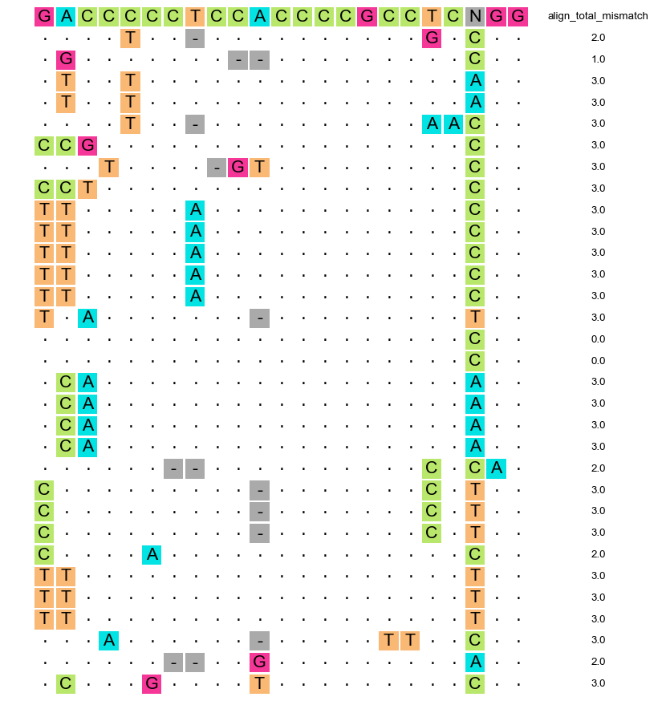

# Detect-seq

A chemical labeling and biotin pulldown approach for the unbiased, genome-wide off-target evaluation of programmable cytosine base editors

# Update log

1. 2021-07-01 first commit. By MENG Haowei
2. 2022-08-19 update version. Codes and algorithm design By MENG Haowei. Website, repository and document management By ZHAO Huanan.

# What is Detect-seq?

Detect-seq aims to find all reliable CBE/DdCBE induced off-target editings on the whole genome.

This set of experiments and analytical procedures were reported by the YiLab @ Peking University in 2021.

Find more at  [www.detect-seq.com](http://www.detect-seq.com)

# What is Detect-seq tool?


Detect-seq tool can help find off-targets editings, sgRNA alignment, and performing visualization of results. One can carry on Detect-seq experiments and then analyze Detect-seq data with the Detect-seq tool.

# Citation

Please cite our publications if Detect-seq is used in your research.

```
# CBE & Detect-seq
1. Lei, Z., Meng, H., Lv, Z., Liu, M., Zhao, H., Wu, H., ... & Yi, C. (2021). Detect-seq reveals out-of-protospacer editing and target-strand editing by cytosine base editors. Nature Methods, 18(6), 643-651.
# DdCBE & Detect-seq
2. Lei, Z., Meng, H., Liu, L., Zhao, H., Rao, X., Yan, Y., ... & Yi, C. (2022). Mitochondrial base editor induces substantial nuclear off-target mutations. Nature, 606(7915), 804-811.
  
```

 

# Requirement, Download, and Usage

## 1. Environment
> only test on linux

```
git clone https://github.com/menghaowei/Detect-seq.git
cd Detect-seq
conda env create -f conda-env.yaml

conda activate DetectSeq
```

- - - - - -

# The best practice of Detect-seq analysis

We provide some test data in the `test` dir. So you can download the BAM files and find Detect-seq signal with the following steps.

## Contents
- [0. A general analysis pipeline](#0-a-general-analysis-pipeline)
- [1. From .BAM to .mpileup file](#1-from-bam-to-mpileup-file)
- [2. From .mpileup to .pmat file](#2-from-mpileup-to-pmat-file)
- [3. Merge .pmat file into .mpmat file](#3-merge-pmat-file-into-mpmat-file)
- [4. Run enrichment test with .mpmat file](#4-run-enrichment-test-with-mpmat-file)
- [5. Select signicicant regions and run sgRNA alignment](#5-select-signicicant-regions-and-run-sgrna-alignment)
- [6. Plot sgRNA alignment results](#6-plot-sgrna-alignment-results)

## 0. A general analysis pipeline

When you obtain the `BAM` files, you can follow this analysis pipeline to get your final off-target list and make a sgRNA alignment plot.


## 1. From .BAM to .mpileup file

### 1.1 Requirement
1. FILE: sorted `BAM`
2. FILE: reference genome `FASTA` (Here we use `hg38.fa` as an example, and this ref file have to match your `BAM`)
3. CMD: `samtools` and version >= 1.9

### 1.2 Run code
You can generate `.mpileup` file from a sorted `.BAM` file with the following command:

```
samtools mpileup -q 20 -Q 20 --reference hg38.fa -o detect_seq.mpileup  detect_seq.sort.bam
```

The output file will be like:

```
chr1	1302588	G	1	^K.	e
chr1	1302589	T	1	.	j
chr1	1302590	G	1	.	o
chr1	1302591	T	1	.	o
chr1	1302592	G	1	.	o
chr1	1302593	T	1	.	s
chr1	1302594	C	1	.	s
chr1	1302595	C	1	.	s
chr1	1302596	A	1	.	s
chr1	1302597	T	1	.	s
```
The `.mpileup` format explain please check the HTML 
[mpileup explain](http://samtools.sourceforge.net/pileup.shtml)


## 2. From .mpileup to .pmat file
### 2.1 Requirement
1. FILE: `.mpileup`
2. CMD: `parse-mpileup-V04.py` (* This command support multiple threads.)
3. CMD: `bmat2pmat-V02.py`

### 2.2 From `.mpileup` to `.bmat` file
You can generate `.bmat` file from a `.mpileup` file with the following command:

```
parse-mpileup-V04.py -i detect_seq.mpileup -o detect_seq.bmat -p 1 -n 0
```

For help info, please run `python parse-mpileup-V04.py -h`:

```
python parse-mpileup-V04.py  -h
usage: parse-mpileup-V04.py [-h] -i INPUT [-o OUTPUT] [-p THREADS] [-n MUTNUM]
                        [--TempDir TEMPDIR]

convert mpileup file to info file

optional arguments:
  -h, --help            show this help message and exit
  -i INPUT, --Input INPUT
                        samtools mpileup format file
  -o OUTPUT, --Output OUTPUT
                        Output parsed file
  -p THREADS, --Threads THREADS
                        Multiple threads number, default=1
  -n MUTNUM, --MutNum MUTNUM
                        Only contain mutation info go to the output, set 0
                        mean output all site, default=0
  --TempDir TEMPDIR     Where to keep temp files, default is the same dir with
                        --Input
```

The `.bmat`format will looks like:

```
chr_name    chr_index    ref_base    A    G    C    T    del_count    insert_count    ambiguous_count    deletion    insertion    ambiguous    mut_num
chr1	1307722	G	0	77	0	1	0	0	0	.	.	.	1
chr1	1307723	C	0	0	78	0	0	0	0	.	.	.	0
chr1	1307724	G	0	79	0	0	0	0	0	.	.	.	0
chr1	1307725	A	70	0	0	0	0	0	0	.	.	.	0
chr1	1307726	C	0	0	75	0	0	0	0	.	.	.	0
chr1	1307727	G	0	74	0	0	0	1	0	.	C	.	0
chr1	1307728	C	0	0	76	0	0	0	0	.	.	.	0
chr1	1307729	C	0	0	75	0	0	0	0	.	.	.	0
chr1	1307730	C	0	0	75	0	0	0	0	.	.	.	0
chr1	1307731	C	0	0	74	0	0	0	0	.	.	.	0
```

### 2.3 select `C-base` and `G-base` info
As we all know, `BAM` files convert all sequence information into the reference strand, which also called forward strand (+). So if a CBE edit occurs on the reverse strand (-), `BAM` file record that information as `G-to-A` rather than `C-to-T`. So it is necessary to split results into two parts, a `C-base` part and the other is `G-base` part, represent forward strand (+) edits and reverse strand (-) edits respectively.

```
# select C-base info (possible foward strand edits)
awk '$3 == "C" {print $0}' detect_seq.bmat > detect_seq.C.bmat 

# select G-base info (possible reverse strand edits)
awk '$3 == "G" {print $0}' detect_seq.bmat > detect_seq.G.bmat 
```

### 2.4 From `.bmat` to `.pmat` file

`.bmat` and `.pmat` files are presented with a little difference. You can generate `.pmat` file from a `.bmat` file with the following command:

```
# For C-base info
bmat2pmat-V02.py -i detect_seq.C.bmat -o detect_seq.C.pmat --InHeader False --InLikeBED False --OutHeader True

# For G-base info
bmat2pmat-V02.py -i detect_seq.G.bmat -o detect_seq.G.pmat --InHeader False --InLikeBED False --OutHeader True
```

For help info, you can run `python bmat2pmat-V02.py -h`

```
usage: bmat2pmat-V02.py [-h] -i INPUT [-o OUTPUT] [-c COVERNUMCUTOFF]
                        [-m MUTNUMCUTOFF] [-r MUTRATIOCUTOFF] [-t MUTTYPE]
                        [--InHeader INHEADER] [--InLikeBED INLIKEBED]
                        [--OutHeader OUTHEADER]

convert bmat file to pmat file

optional arguments:
  -h, --help            show this help message and exit
  -i INPUT, --Input INPUT
                        Input bmat file
  -o OUTPUT, --Output OUTPUT
                        Output BED format file
  -c COVERNUMCUTOFF, --CoverNumCutoff COVERNUMCUTOFF
                        Site coverage number cutoff default=0
  -m MUTNUMCUTOFF, --MutNumCutoff MUTNUMCUTOFF
                        Site mutation number cutoff default=0
  -r MUTRATIOCUTOFF, --MutRatioCutoff MUTRATIOCUTOFF
                        Site mutation ratio cutoff default=0
  -t MUTTYPE, --MutType MUTTYPE
                        Select mutation type, ALL means no selection, can set
                        like CT, default=ALL
  --InHeader INHEADER   If contain header line in input file, default=True
  --InLikeBED INLIKEBED
                        If input bmat file looks like bed file, default=False
  --OutHeader OUTHEADER
                        If contain header line in output file, default=True
```

## 3. Merge .pmat file into .mpmat file
### 3.1 Requirement
1. FILE: reference genome `FASTA` (Here we use `hg38.fa` as an example, and this ref file have to match your `BAM`)
2. FILE: `.pmat` file
3. FILE: SNP annotation as `.vcf` format (not necessary)
4. CMD: `pmat-merge-V04.py`

### 3.2 Explain
The `pmat` file only records single site information on each line, so we next try to search the tandem `C-to-T` (as `G-to-A` for reverse strand) pattern in the whole genome by `pmat-merge-V04.py` command. 

And you can use the `--SNP` option to set SNP information to ignore SNP or SNV signals during your Detect-seq analysis. 

### 3.3 Run code

```
# For C-to-T .pmat merge
pmat-merge-V04.py -f C -t T -r hg38.fa --OutHeader False \
-i detect_seq.C.pmat -o detect_seq.CT.mpmat \
-d 50 -D 100 --NoMutNumCutoff 2 --OmitTandemNumCutoff 2 --SNP SNP_info.vcf & 

# For G-to-A .pmat merge
pmat-merge-V04.py -f G -t A -r hg38.fa --OutHeader False \
-i detect_seq.G.pmat -o detect_seq.GA.mpmat \
-d 50 -D 100 --NoMutNumCutoff 2 --OmitTandemNumCutoff 2 --SNP SNP_info.vcf & 
```

For help info, you can run `python pmat-merge-V04.py -h`

```
usage: pmat-merge-V04.py [-h] -i INPUT [-o OUTPUT] [-f FROMBASE] [-t TOBASE]
                         -r REFERENCE [-d MAXSITEDISTANCE]
                         [-D MAXREGIONDISTANCE]
                         [--NoMutNumCutoff NOMUTNUMCUTOFF]
                         [--OmitTandemNumCutoff OMITTANDEMNUMCUTOFF]
                         [--SNP SNP] [--OutHeader OUTHEADER]
                         [--InHeader INHEADER]

merge pmat file

optional arguments:
  -h, --help            show this help message and exit
  -i INPUT, --Input INPUT
                        Input bmat file
  -o OUTPUT, --Output OUTPUT
                        Output BED format file
  -f FROMBASE, --FromBase FROMBASE
                        Ref base, accept A,G,C,T default=C
  -t TOBASE, --ToBase TOBASE
                        Mut base, accept A,G,C,T default=T
  -r REFERENCE, --reference REFERENCE
                        Reference genome fasta file
  -d MAXSITEDISTANCE, --MaxSiteDistance MAXSITEDISTANCE
                        Max distance between two sites in one region,
                        default=50
  -D MAXREGIONDISTANCE, --MaxRegionDistance MAXREGIONDISTANCE
                        Max length of a mutation region, default=100
  --NoMutNumCutoff NOMUTNUMCUTOFF
                        The number of site without mutation --ToBase signal in
                        a mutation region, default=2
  --OmitTandemNumCutoff OMITTANDEMNUMCUTOFF
                        The omit tande site cutoff, default=2
  --SNP SNP             SNP file with vcf or bed format, if use multiple file,
                        use ',' to separate, default=None
  --OutHeader OUTHEADER
                        If contain header line in output file, default=True
  --InHeader INHEADER   If contain header line in input file, default=True
```


## 4. Run enrichment test with .mpmat file 
### 4.1 Requirement
1. FILE: `.mpmat`
2. FILE: Genome background file in `.json` format
3. CMD: `calculate-mut-stats-V02.py` (* This command support multiple threads.)
4. CMD: `find-significant-mpmat-V02.py`

### 4.2 Merge `C-to-T` and `G-to-A` `.mpmat` files
In this step, we should merge two strands `.mpmat` file together.

```
# merge file 
cat detect_seq.CT.mpmat detect_seq.GA.mpmat > detect_seq.merge.mpmat

# sort file 
bedtools sort -g hg38.fa.fai -i detect_seq.merge.mpmat  > detect_seq.merge.sort.mpmat
```

### 4.3 Count genome background and generate `.json` files
Next to calculate genome background before running a statistical test. 

```
# ctrl sample
calculate-mut-stats-V02.py -i Full.Ctrl.bam -r hg38.fa -p 1 -o background_ctrl.json

# treat (PD) sample
calculate-mut-stats-V02.py -i Full.Treat.bam -r hg38.fa -p 1 -o background_treat.json
```

This step has to provide a full-size bam with all genome mapping reads into a script, so here we just show a pretend demo. And you can find `background_ctrl.json` and `background_treat.json` files in the `test` dir.

### 4.4 Run Poisson test
Run Poisson test with `find-significant-mpmat-V02.py` and this idea refers to [MACS2](https://github.com/taoliu/MACS)

```
find-significant-mpmat-V02.py \
-i detect_seq.merge.sort.mpmat \
-c detect_seq.ctrl.sort.bam \
-t detect_seq.sort.bam \
-r hg38.fa \
-m background_ctrl.json \
-n background_treat.json \
-g hg38.json \
-o detect_seq.StatsTest.table \
--region_mutation_min_cutoff 2 \
--query_mutation_type CT,GA \
--query_mutation_min_cutoff 2 \
--query_mutation_max_cutoff 18 \
--other_mutation_max_cutoff 12 \
--total_mutation_max_cutoff 26
```

Then you will have a test result like:

```
chr_name    region_start    region_end    ctrl_count    treat_count    ctrl_mut_count    treat_mut_countctrl_count.norm    treat_count.norm    ctrl_mut_count.norm    treat_mut_count.norm    log2_FC    log2_FC_mut    p_value    FDR
chr1	1303462	1303462	5	3	0	0	0.0	0.0	3.60519843946	1.52868309363	NA	-1.23778931409	0.9433256859064737	0.9433256859064737
chr1	1303610	1303612	2	4	0	1	0.0	0.50956103121	1.44207937578	2.03824412484	-0.972673143489	0.499176280075	0.8426930101168323	0.9433256859064737
chr1	1303615	1303615	2	4	0	0	0.0	0.0	1.44207937578	2.03824412484	NA	0.499176280075	0.9433256859064737	0.9433256859064737
chr1	1303634	1303637	2	4	0	1	0.0	0.50956103121	1.44207937578	2.03824412484	-0.972673143489	0.499176280075	0.8426930101168323	0.9433256859064737
chr1	1307688	1307704	0	108	0	105	0	53.50390828	0	55.03259137	5.741572374	5.782214359	1.50E-16	6.89E-14
chr1	93448687	93448710	6	85	1	75	0.721039688	38.21707734	4.326238127	43.31268765	5.727994971	3.323604715	6.58E-12	2.27E-09
chr1	109629398	109629446	6	157	0	144	0	73.37678849	4.326238127	80.0010819	6.197251858	4.208834528	1.42E-22	8.42E-20
chr2	396529	396546	5	36	0	31	0	15.79639197	3.605198439	18.34419712	3.981523167	2.347173187	2.27E-05	0.00471216
```

The output table column explain is:

- `ctrl_count` reads count in control `BAM` file
- `treat_count` reads count in treat `BAM` file
- `ctrl_mut_count` reads count in control `BAM` file with tandem mutation signals
- `treat_mut_count` reads count in treat `BAM` file with tandem mutation signals
- `ctrl_count.norm` nomalized reads count in control `BAM` file
- `treat_count.norm` nomalized reads count in treat `BAM` file 
- `ctrl_mut_count.norm` nomalized mutation reads count in control `BAM` file
- `treat_mut_count.norm` nomalized mutation reads count in treat `BAM` file
- `log2_FC` calculate as `log2_FC = log2(treat_count.norm / ctrl_count.norm)`
- `log2_FC_mut` calculate as `log2_FC_mut = log2(treat_mut_count.norm / ctrl_mut_count.norm)`
- `p_value` Poisson test pvalue
- `FDR` Adjust pvalue with Benjamini-Hochberg method.

## 5. Select signicicant regions and run sgRNA alignment
### 5.1 Requirement
1. FILE: `detect_seq.StatsTest.table`
2. CMD: `mpmat-to-art-V04.py`

### 5.2 Select significant region
Related to our experience, the regions with the following criterion can be considered as enriched off-targets region:

1. `FDR` < 0.05;
2. `log2_FC_mut` > 1;
3. `ctrl_mut_count` < 3 OR `ctrl_mut_count.norm` < 3;

After this select step, we can obtain `detect_seq.StatsTest.Sign.table`.

### 5.2 Select `.mpmat` file 
```
bedtools intersect -a detect_seq.merge.sort.mpmat -b detect_seq.StatsTest.Sign.table -wa > detect_seq.merge.sort.Sign.mpmat
```

### 5.3 Run sgRNA alignment
You can run sgRNA alignment as the following command. Only one thing you should take care of, the `--sgRNA` sequence has to include `PAM` info.

```
mpmat-to-art-V04.py \
-i detect_seq.merge.sort.Sign.mpmat -r hg38.fa --sgRNA GACCCCCTCCACCCCGCCTCCGG > detect_seq.merge.sort.Sign.art
```
For more alignment options you can run `python mpmat-to-art-V04.py -h`

```
usage: mpmat-to-art-V04.py [-h] -i MPMAT_TABLE --sgRNA SGRNA
                           [-o OUT_ALIGNMENT_RESULT] -r REFERENCE
                           [-s SAMPLE_NAME] [--extend_method EXTEND_METHOD]
                           [--align_dist_to_signal ALIGN_DIST_TO_SIGNAL]
                           [--bedtools_path BEDTOOLS_PATH]
                           [--align_method ALIGN_METHOD]
                           [--align_settings ALIGN_SETTINGS]
                           [--align_min_score ALIGN_MIN_SCORE]
                           [--input_header INPUT_HEADER]
                           [--input_sep INPUT_SEP]
                           [--more_colname MORE_COLNAME]

From .mpmat to alignment result table (.art) file

optional arguments:
  -h, --help            show this help message and exit
  -i MPMAT_TABLE, --mpmat_table MPMAT_TABLE
                        .mpmat table file, generated from <pmat-merge.py> or
                        <mpmat-select.py>
  --sgRNA SGRNA         sgRNA sequence with PAM (NGG/NAG) sequence
  -o OUT_ALIGNMENT_RESULT, --out_alignment_result OUT_ALIGNMENT_RESULT
                        Output alignment result table (.art) filename,
                        default=Stdout
  -r REFERENCE, --reference REFERENCE
                        Reference genome fasta file
  -s SAMPLE_NAME, --sample_name SAMPLE_NAME
                        Sample name of this .mpmat, default=run_mpmat
  --extend_method EXTEND_METHOD
                        Select and extend region of mpmat file to get FASTA
                        file, <region> <upstream_site> <downstream_site>
                        <highest_site>, default=highest_site
  --align_dist_to_signal ALIGN_DIST_TO_SIGNAL
                        If distance too far between mutation signal and
                        alignment, consider as there is no appropriate
                        alignment, default=20
  --bedtools_path BEDTOOLS_PATH
                        Software <bedtools> PATH, default considered
                        <bedtools> is already included in current PATH
                        environment.
  --align_method ALIGN_METHOD
                        Provide two methods, <PAM_first> <fair_align>,
                        'PAM_first' treat PAM region with a higher weight,
                        default=fair_align
  --align_settings ALIGN_SETTINGS
                        Set <align_match_score> <align_mismatch_score>
                        <align_gap_open_score> <align_gap_extension_score>,
                        default=5,-4,-24,-8
  --align_min_score ALIGN_MIN_SCORE
                        If alignment score lower than this, consider as no
                        appropriate alignment, default=15
  --input_header INPUT_HEADER
                        If .mpmat file contain header, default=False
  --input_sep INPUT_SEP
                        default=\t
  --more_colname MORE_COLNAME
                        More info you want to include in output table, so you
                        can write the column names like col1,col2...
                        default=None
```

## 6. Plot sgRNA alignment results
### 6.1 Requirement
1. FILE: `detect_seq.merge.sort.Sign.art`
2. CMD: `plot-art-V01.py`

### 6.2 Run code
```
plot-art-V01.py -i detect_seq.merge.sort.Sign.art --sgRNA GACCCCCTCCACCCCGCCTCCGG --out_figure_format png -o out.art.png
```

After a few seconds, you can obtain an image with a match and mismatch information between the sgRNA sequence and off-target region.


