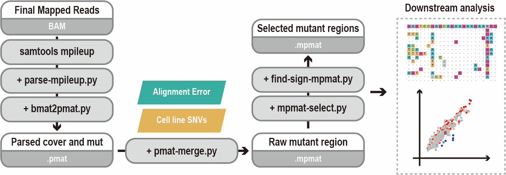

# What is Detect-seq?
Detect-seq is short for ***dU-detection enabled by C to T transition during sequencing***. 

This method performs the genome-wide identification of CBE-induced off-targets in the cellular context. And Detect-seq is based on chemical labeling and enrichment of the direct editing products of CBE, which can trace the in vivo editing events in an unbiased manner.

This technique is developed by YiLab @ School of Life Sciences, Peking University, Beijing, China.


# What is Detect-seq tools?
Detect-seq tools are a collection of Python scripts, which is designed for the analysis of Detect-seq data. The tools can help to perform Detect-seq analysis including but are not limited to off-targets finding sgRNA alignment, and visualization of results.


# Requirement, Download and Usage

## 1. Requirement 

### Python version
- Python = 2.7x

### Necessary Python packages
- Biopython >= 2.2.4
- pysam >= 0.15
- pandas >= 0.24.2
- numpy >= 1.16.2
- matplotlib >= 1.74
- scikit-learn >= 0.20.3

## 2. Download and usage

All Python code in this repertory can be directly downloaded and used like:

```
python + sepecific_cmd 
```

## 3. Future 
We are going to distribute Detect-seq tools on `pip`, which will be coming soon! 


- - - - - - 


# The best practice of Detect-seq analysis

We provide some test data in `test` dir. So you can download the BAM files and find Detect-seq signal with the following steps.

## Contents
- [0. A general analysis pipeline](#0-a-general-analysis-pipeline)
- [1. From `BAM` to `mpileup`](#1-from--bam--to--mpileup-)
- [2. From `mpileup` to `pmat`](#2-from--mpileup--to--pmat-)
- [3. Merge `pmat` file into `mpmat`](#3-merge--pmat--file-into--mpmat-)
- [4. Run enrichment test with `mpmat` file](#4-run-enrichment-test-with--mpmat--file)
- [5. Select signicicant regions and run sgRNA alignment](#5-select-signicicant-regions-and-run-sgrna-alignment)
- [6. Plot sgRNA alignment results](#6-plot-sgrna-alignment-results)

## 0. A general analysis pipeline


When you obtain the `BAM` files, you can follow this analysis pipeline to get your final off-target list and make a sgRNA alignment plot.


## 1. From `BAM` to `mpileup`

## 2. From `mpileup` to `pmat`

## 3. Merge `pmat` file into `mpmat`

## 4. Run enrichment test with `mpmat` file 

## 5. Select signicicant regions and run sgRNA alignment

## 6. Plot sgRNA alignment results


## Tool list

### From `BAM` file to `.mpmat` file

- `parse-mpileup.py` parse mpileup file into `.bmat` file
 
- `bmat2pmat.py` convet `.bmat` file into `.pmat` file

- `pmat-merge.py` merge `.pmat` file and generate `.mpmat` file

### Find the significant off-target region

- `mpmat-select.py` select `.mpmat` file with the setting criterion, which can help you distinguish the real Detect-seq signals from the background.

- `filter-mpmat-high-mismatch.py` Remove `.mpmat` regions with severe mismatch issue, commonly are highly repetitive regions. 

- `find-significant-mpmat.py` Run a statistical test and report significant `.mpmat` file.

### Plot off-target alignment result table (`.art` file)

- `mpmat-to-art.py` Alignment sgRNA with off-target, generate `.art` file

- `plot-art.py` Plot `.art` file, output image like:


